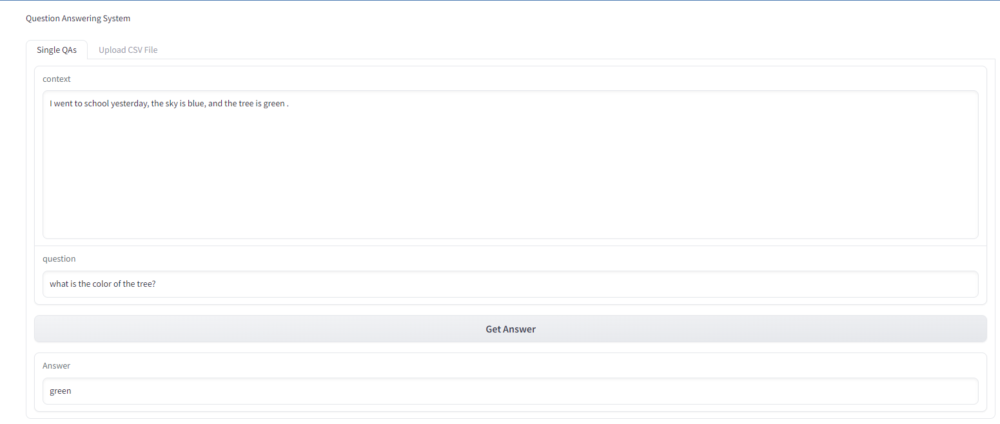
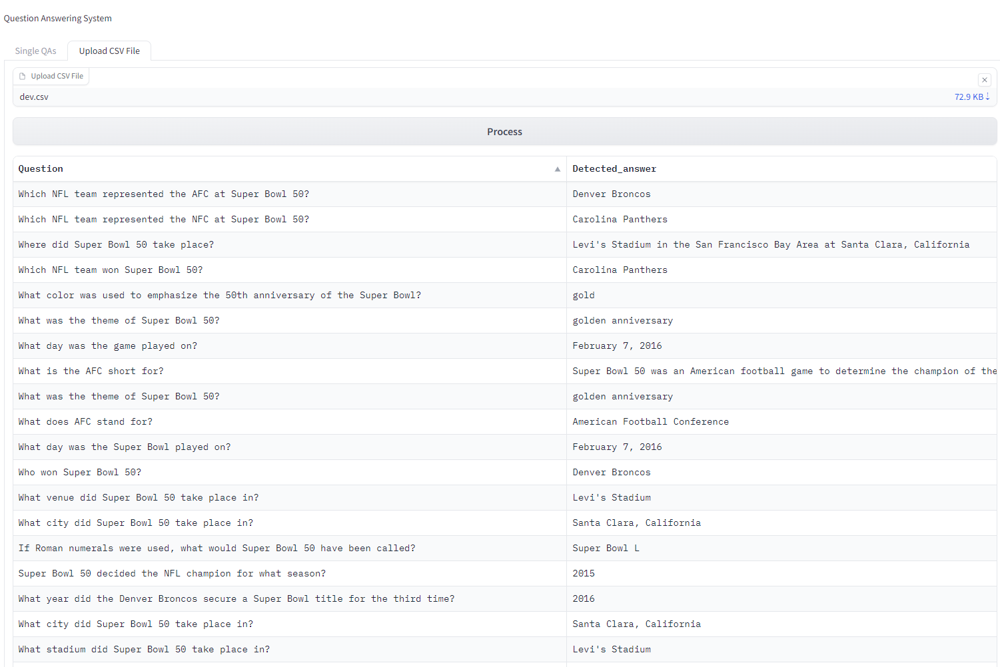

# Question Answering system using a Pre-trained Bert based model 💬

Question-answering models can retrieve the answer to a question from a given text, which is useful for searching for an answer in a document. <br> Some question-answering models can generate answers without context! (Hugging Face)
<h2>Types of Question Answering Models</h2>
<ul>
<li>Extractive Question Answering 
<li>Open Generative Question Answering 
<li>Closed Generative Question Answering 
</ul>

Our system is the Extractive Question Answering system, which means that you have a context and a question to ask, and the model assumes that the answer is inside the context provided.

<h2>QA-system interface using <code>Gradio</code> 🚀:</h2>



<h2>Dataset Overview</h2>
The question-answering system in this project is evaluated using the Stanford Question Answering Dataset <code>(SQUAD)</code>. <br>SQUAD is a widely used benchmark dataset for evaluating machine reading comprehension and question-answering systems.<br>
The SQUAD dataset contains a diverse set of passages from a variety of topics and genres.
<br>
<h3>Each example in the dataset consists of the following components:</h3>
<ul>
<li>Context Paragraph: A corpus that contains the information from which the answer can be extracted.
<li>Question: A question related to the context, formulated to prompt the model to extract the relevant answer.
<li>Answer Span: The exact span of text within the context paragraph that serves as the answer to the question.
</ul>
The dataset can be found here: <a href= "https://huggingface.co/datasets/squad">SQuAD link</a>

<h2>Setup Instructions</h2>
<h3>Requirements:</h3>
<ul>
    <li>Python version => 3.6 is recommended
    <li>Operating System: Windows
</ul>

<h3>Python Packages Required: </h3>
<ul> 
    <li>
        datasets==2.14.4
    <li>
        numpy==1.24.4
    <li>
        pandas==2.0.3
    <li>
        tokenizers==0.13.3
    <li>
        torch==2.0.1
    <li>
        transformers
    <li>
        import torch
    <li>
        pytest

</ul>

<h3>To use the question-answering system, follow these steps:</h3>

1. Clone the source
    ```
	git clone https://github.com/geehaad/Question-Answering.git
	```
    Go to the directory you cloned the repo in, open cmd:
    ```
    cd Question-Answering
    ```
2. Create a virtual environment (replace `venv` with your virtual environment name):
    * Using conda, in CMD write:
        ```
        conda create -p venv python==3.8
        ```

3. Activate the virtual environment:
    ```
    conda activate venv\
    ```

4. Run the main script:
    ```
    python src/components/main.py
    ```
5. The output is a CSV file called 'output' in your directory.
   
6. To run the testing file:
    ```
    pytest src/tests/test_answer_questions.py
    ```
</code>

<h2>Model and Question Answering System</h2>
<ul>
<li>Model used:
    <ul>
        <li><b>Model name: <code>'distilbert-base-cased-distilled-squad'</b></code> - a variant of the DistilBERT model that has been fine-tuned specifically for the SQuAD. This model is designed to accurately extract answers from a given context.</li>
    </ul>
<li>How the System Works:
    <ul>
    Our Question Answering system takes a context paragraph and a question as inputs and aims to extract relevant answers from the context.<br>
    Using multiple steps:
        <li><code>Tokenization:</code>  The system takes a question and a context as input, then the context paragraph and question are tokenized into subword tokens using the tokenizer provided by the Hugging Face Transformers library of AutoModelForQuestionAnswering. 
        <li><code>Process input through the model:</code> The tokenized inputs are passed through the distilbert-base-cased-distilled-squad model. This model has been fine-tuned on the squad dataset.
        <li><code>Extract the answer span:</code> The model's output consists of logits (probabilities) for each token in the context paragraph. The tokens with the highest start and end logits are to the beginning and end of the answer span within the context.
        <li><code>Generating Answer:</code> By decoding the answer span tokens, we generate the final answer string. This answer is then returned as the output of the system.
        <li><code>Evaluate the model:</code> using the first 100 rows of the squad dataset to evaluate the performance of the QAS.
        <li><code>Testing:</code> By using pytest with multiple test cases.
    </ul>
</ul>

<h2>Project Directory Structure</h2>
The project directory is organized in a structured manner to facilitate easy navigation.<br>
Below is an overview of the key folders and files within the project:

<pre>
Question-Answering/
|-- notebooks/
|   |-- trails.ipynb
|-- src/
|   |-- __init__.py
|   |-- components/
|   |   |-- __init__.py
|   |   |-- helper.py
|   |   |-- main.py
|   |-- tests/
|   |   |-- __init__.py
|   |   |-- test_answer_questions.py
|-- requirements.txt
|-- README.md
</pre>

<h2>How Files Are Used</h2>
<code>src/</code>: This folder contains the main source code of the project which are:
<ul></p>
    <li><p><code>components/</code>: The heart of the project, where the primary functionality resides, and contains:</p>
        <ul>
            <li>
            <code>helper.py</code>: This file contains the core functions that enable the question-answering system, These functions are: 
            <ul>
                <li>The <code>answer_questions</code> function takes a context and a question as input, tokenizes, and extracts answers using the chosen model. 
                <li>The <code>apply_answer_questions</code> function applies the answer_questions function to a dataset, generating dictionaries containing the question, original answer, and detected answer.
            </ul>
            <li>
            <p><code>main.py</code>: The entry point of the project, where the main function utilizes the <code>apply_answer_questions</code> function on a subset of the dataset, 100 rows and saves the results in a CSV file.</p>
        </ul>   
    <li><p><code>tests/</code>:</p>
    <ul>
    <li><p><code>test_answer_questions.py</code>: Contains pytest test cases that validate the accuracy of the question answering system, the function in this file uses parameterized testing to check the behavior of the answer_questions function in different situations.</p>
    </ul>     
</ul>
<p><code>notebooks/</code>:
<ul> <li><code>trails.ipynb</code>: The Jupyter notebook <code>trails.ipynb</code> is a sandbox for experimentation. It's used to explore the dataset and try different models before integrating them into the main system.
</ul>


<p><code>requirements.txt</code>: Lists the Python packages required for the project to run successfully.</p>
<p><code>README.md</code>: The central documentation file containing essential information about the project, its usage, and directory structure.</p>

